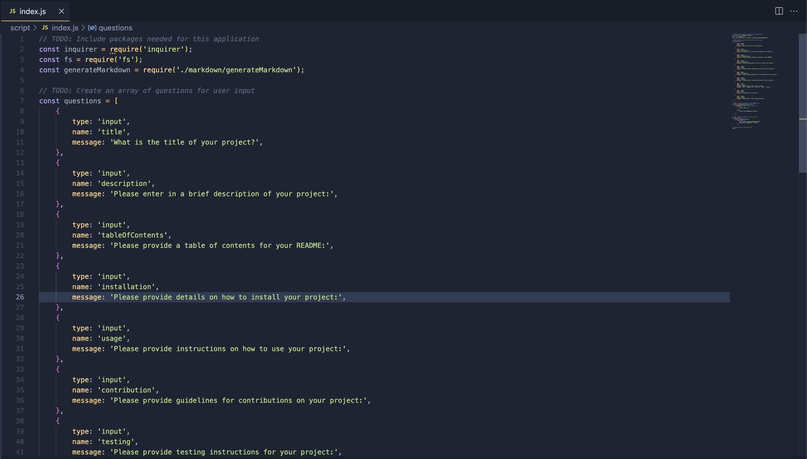
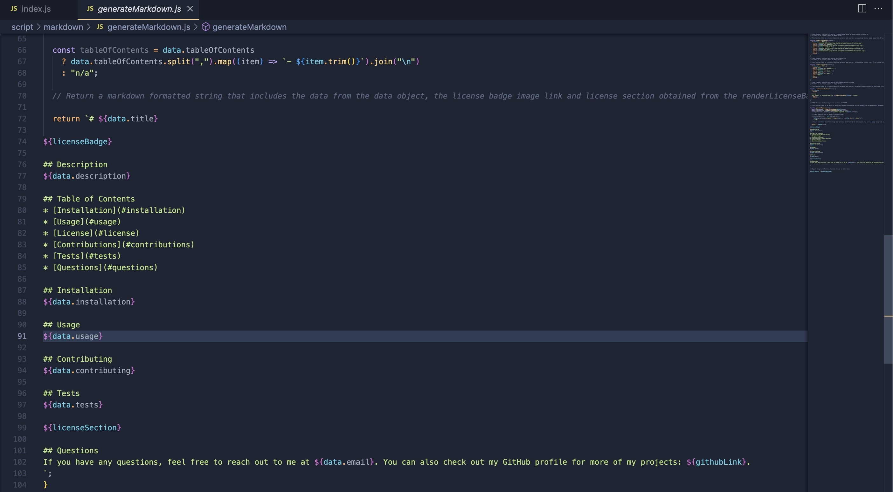

# Create a Pro README

# Description

This application will take the users information and turn it into a README.md file. It asks for the title of the project, a brief description, table of contents, how to install and use the project, guidelines for contributions, testing, what license the user is using, email and github username. The app will take this data and build a README.md

# Table of Contents
* [Installation](#installation)
* [Usage](#usage)
* [Credits](#credits)

# Installation

To install this project, clone the repository from GitHub and open it in your own IDE.

# Video

https://drive.google.com/file/d/1F9nsueC6-nMZZo_QoTH6MLVhWj0pNDvP/view

# Usage

In your IDE, open the command line and type in node index.js

Screenshots of the code

# Credits

I used the starter code from https://github.com/coding-boot-camp/potential-enigma and built the rest of the app with inquirer and node.js